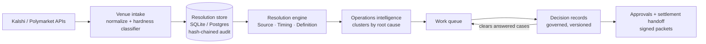

# Arbiter

**A market operations and resolution console for event-contract exchanges.**

Arbiter reads live markets from Kalshi and Polymarket and finds the few that will need a human
judgment when they resolve: contested wording, conflicting official sources, data that gets
revised. It puts them in one work queue. An operator records one governed decision, and that
decision clears every case it answers. Each step lands in a hash-chained audit trail.

> AI interprets. Policy governs. Evidence proves. Deterministic logic resolves. Humans handle exceptions.

## Run it

Requires Python 3.11+ and Node 22.

```bash
./start.sh
```

Then open:

| Page | What it is |
|---|---|
| `http://localhost:8000/` | Home: exposure overview, exception workspace, contract design review |
| `http://localhost:8000/console.html` | Operations console: work queue, clusters, case workspace |
| `http://localhost:8000/decision-workbench.html` | Decision workbench: record a decision, see what it clears |

Pull live venue markets into the queue (run from a machine that can reach the venue APIs):

```bash
python3 scripts/sync_venues.py --discover 500 --dry-run
python3 scripts/sync_venues.py --discover 500
```

A typical scan of 500 open Kalshi markets flags about 20 for human review. The rest resolve
mechanically and stay out of the queue.

## How it fits together



Details: [docs/ARCHITECTURE.md](docs/ARCHITECTURE.md).

## How it's tested

```bash
make install
make check
```

`make check` runs lint, format check, unit and consistency tests, then starts the app and the
public API on throwaway databases and runs all 26 gate scripts, including the full release gate
(**452 checks across 18 suites**). CI runs the same on every pull request.

## Status

Arbiter runs end to end on live venue data locally. It is **not** certified for production
settlement. The benchmark report states `production_settlement_certified: false`, and it stays that way until an external security review,
penetration test and deployment-backed resilience evidence exist. What is production-shaped,
what is a reference implementation, and the known limits are in
[docs/DILIGENCE.md](docs/DILIGENCE.md).

## Repository

| Path | Contents |
|---|---|
| `backend/app/` | FastAPI service, engines, stores |
| `frontend/` | React + Vite UI (three entry pages) |
| `scripts/` | Gate scripts, venue sync, benchmark tooling |
| `tests/` | pytest suite and recorded venue scans |
| `benchmarks/` | Benchmark seeds and frozen datasets |
| `demo/` | Worked case run through the real engine |
| `deploy/` | Deployment templates |
| `docs/` | Architecture, diligence, API, product, operations, releases |
| `CHANGELOG.md` | Every release, newest first |

Copyright (c) 2026 Operation Mincemeat LLC. All rights reserved. See [LICENSE](LICENSE).
